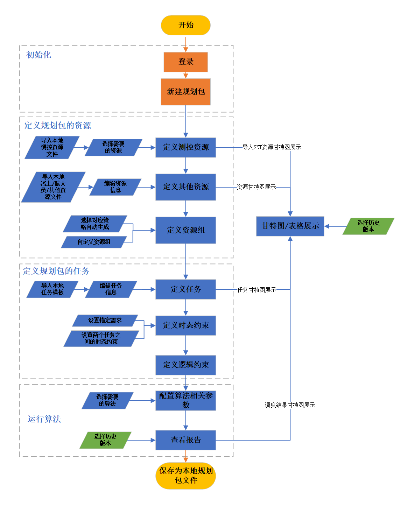
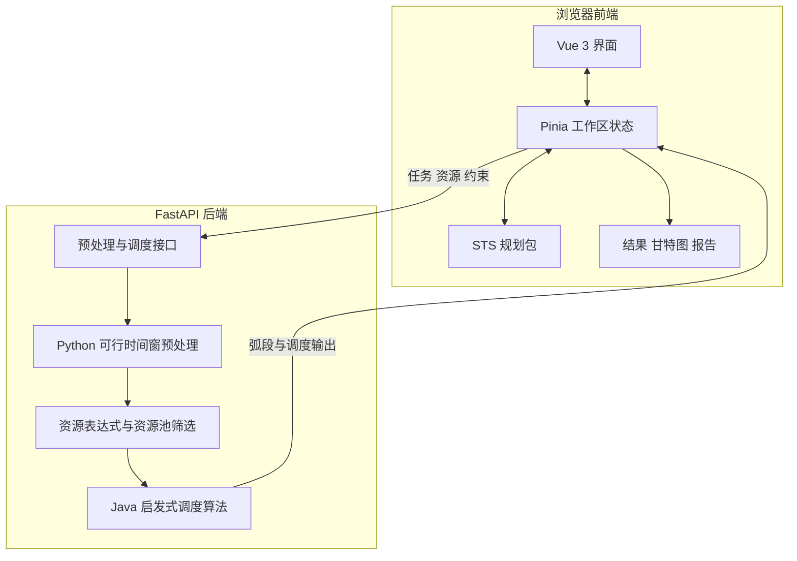

# 航天任务调度工具（SpaceTaskScheduler）

航天任务调度工具是一个面向**航天器飞控任务规划与测控资源调度**的可视化原型系统。它把一次规划工作中的规划周期、测控资源、任务、约束、可行时间窗、调度结果和分析报告统一保存在一个规划包中，并提供从建模到运行、查看和导出的完整工作流。

项目由华中科技大学管理系统工程研究中心祁超团队建设，主要用于航天任务规划与调度研究、算例演示和业务流程验证。

> 当前系统已接入基于优先级的启发式调度算法。COPT 和分支定价切割算法仍是预留入口，暂不可运行。



## 这个项目解决什么问题

在一个规划周期内，多个航天任务会竞争有限的测控资源。每个任务有自己的可执行时间、持续时间、优先级和资源需求；每个资源也有可用时间窗和能力限制。系统的目标是把这些信息组织起来，计算任务的候选测控弧段，并给出一套可查看、可保存、可复现的调度安排。

典型使用流程如下：


## 当前已实现的能力

| 模块 | 能力 |
| --- | --- |
| 规划包 | 新建、打开、另存为 `.sts`；恢复完整工作状态；兼容旧版规划包 |
| 历史文档 | 在浏览器本地保存最近 12 个规划包快照，可搜索、重新打开、下载和删除 |
| 规划属性 | 设置规划包名称、描述、规划时间范围以及资源/任务优先级规则 |
| 资源建模 | 定义资源基本信息、可用性时间窗、容量属性、占用情况和资源组 |
| 任务建模 | 定义任务基本信息、时间窗、持续时间、优先级和调度状态 |
| 资源需求 | 使用资源、资源组、资源池、`and`、`or` 和括号构造受限表达式 |
| 任务资源池 | 为单个任务组合资源或资源组，支持“全部资源”与“指定数量”语义 |
| 约束建模 | 编辑锚定需求、时态约束和逻辑任务组约束 |
| 可行时间窗 | 支持单任务计算和任务列表批量计算，展示候选测控弧段及资源占用 |
| 调度算法 | 自动预处理当前规划包并运行基于优先级的 Java 启发式算法 |
| 结果展示 | 查看任务分配状态、开始/结束时间、测控弧段和使用资源 |
| 主视图 | 提供资源甘特图、任务甘特图和日程表视图 |
| 报告 | 动态生成摘要、调度、任务、资源、任务组和未分配任务报告，可下载 Markdown |
| 示例数据 | 内置 3 套 2026 年规划场景，可下载单个 `.sts` 或多个示例合集 ZIP |

## 核心概念

### 规划包

规划包是系统中的工作单元，扩展名为 `.sts`，本质上是包含多个 JSON 文件的 ZIP 包。它不仅保存任务和资源，还会保存约束、可行时间窗、算法输出和当前调度状态，因此可以在另一台机器或之后的会话中继续使用。

当前规划包格式版本为 `2`，主要包含：

| 文件 | 内容 |
| --- | --- |
| `manifest.json` | 规划包格式、版本和创建时间 |
| `basicConfig.json` | 名称、描述、规划周期和优先级规则 |
| `resourceDetail.json` | 资源明细、可用性和占用 |
| `taskDetail.json` | 任务明细、资源需求、资源池和调度状态 |
| `constraintDetail.json` | 锚定、时态和逻辑约束 |
| `resourceCatalog.json` | 资源组与测控资源目录 |
| `executionDetail.json` | 预处理结果和算法输出 |

### 可行时间窗

可行时间窗是任务在满足任务时间范围、测控资源可用性和资源需求表达式后得到的候选弧段。它可以在任务详情中单独计算，也可以在任务列表中批量计算。单任务计算不会覆盖启发式算法使用的批量输入。

### 资源需求与资源池

资源需求表达式支持资源名、资源组名和任务级资源池，例如：

```text
天链资源组 and (北京站-TIANHE or 主备资源池)
```

资源池可以直接包含资源，也可以包含资源组：

- `all`：候选方案必须包含资源池展开后的全部成员。
- `count`：候选方案至少包含资源池中的指定数量成员。

后端使用受限表达式解析器处理这些条件，不执行任意代码。

## 系统如何工作



运行算法时，前端会先把当前规划包中的任务、资源和资源目录发送到后端。后端在独立临时目录中完成预处理和资源需求筛选，成功后再发布本批次算法输入；随后调用仓库内置的 Java JAR 运行启发式调度。结果返回前端后，会同步驱动结果页、甘特图、日程表和报告。

## 最快体验方式

1. 启动前端和后端。
2. 点击页面右上角的下载图标。
3. 选择“2026 综合演示”并下载 `.sts`。
4. 点击顶栏“打开”，选择刚下载的规划包。
5. 依次查看属性、资源、任务和约束。
6. 打开“运行”，保持默认启发式算法并点击“运行”。
7. 系统完成预处理和算法计算后会自动进入调度结果页。
8. 在“主视图”查看资源/任务甘特图，在“报告”中查看并下载分析结果。

选择多个示例时下载的是 ZIP 合集，需要先解压，再打开其中的 `.sts` 文件。ZIP 合集本身不是规划包。

内置示例包括：

- `2026-small-continuous.sts`：3 个连续跟踪任务，2 个资源。
- `2026-non-continuous-control.sts`：6 个非连续任务，3 个资源。
- `2026-integrated-demo.sts`：连续和非连续任务混合场景。

## 本地运行

### 环境要求

- Node.js 20 LTS（推荐）
- npm 10+
- Python 3.9+
- Java 运行环境，且 `java` 命令可从终端直接调用
- Windows、Linux 或 macOS；当前项目主要在 Windows 环境下开发和验收

仓库已经包含启发式算法 JAR：

```text
backend/interface/java/your-project-1.0.0-jar-with-dependencies.jar
```

### 1. 启动后端

在项目根目录打开终端：

```powershell
cd backend
python -m venv .venv
.venv\Scripts\Activate.ps1
python -m pip install --upgrade pip
python -m pip install -r requirements.txt
python -m uvicorn main:app --reload --host 0.0.0.0 --port 8000
```

Linux/macOS 激活虚拟环境：

```bash
source .venv/bin/activate
```

后端地址：`http://localhost:8000`

接口文档：`http://localhost:8000/api/docs`

### 2. 启动前端

另开一个终端：

```powershell
cd frontend
npm install
npm run dev
```

前端地址：`http://localhost:5173`

前端当前直接请求 `http://localhost:8000`，因此本地开发时后端应使用 `8000` 端口。后端 CORS 已允许本地 `5173` 和 `5174` 端口。

### 常见启动问题

**页面提示“网络连接失败”**

确认后端进程仍在运行，并检查浏览器是否能打开 `http://localhost:8000/api/docs`。

**算法运行时报 Java 或 JAR 错误**

运行 `java -version` 确认 Java 已安装并加入 `PATH`，同时确认上述 JAR 文件存在。

**示例合集无法直接打开**

多选示例下载的是 `.zip`，请先解压，再选择其中一个 `.sts` 文件。

**安装旧版数值计算依赖失败**

后端预处理代码依赖 `pandas` 和 `numpy`，仓库中的版本约束来自现有算法环境。建议优先使用项目已验证的 Python/Conda 环境；若新环境无法直接安装，不要随意升级依赖后提交，应先验证预处理结果与算法输入兼容性。

## 开发与验证

### 前端

```powershell
cd frontend
npx vitest run
npm run build-only
```

- `npx vitest run`：一次性运行前端单元测试。
- `npm run build-only`：生成生产资源到 `frontend/dist`。
- `npm run dev`：启动开发服务器。

项目当前仍有一组既有的 JavaScript 模块声明和 `Task.vue` 类型问题，因此包含 `vue-tsc` 的 `npm run build` 可能失败；纯生产打包请使用 `npm run build-only`。

### 后端

```powershell
cd backend
python -m pip install -r requirements-dev.txt
python -m pytest tests -q
python -m py_compile main.py interface/preprocess_support.py
```

### 当前回归基线

截至 2026-08-16：

- 前端 Vitest：47 个通过，1 个集成测试按配置跳过。
- 后端 pytest：12 个通过。
- Vite 生产打包、定向 ESLint 和 Python 编译通过。

## 项目结构

```text
spacetaskscheduler/
├─ frontend/                         Vue 3 前端
│  ├─ src/views/                     规划流程与结果页面
│  ├─ src/components/                表格、甘特图、导航和业务组件
│  ├─ src/stores/                    Pinia 工作区状态
│  ├─ src/services/                  规划包、预处理、算法和报告服务
│  └─ API_README.md                  前端使用的接口说明
├─ backend/                          FastAPI 后端
│  ├─ main.py                        API 入口
│  ├─ interface/                     预处理、格式转换、算法 JAR 与数据目录
│  ├─ tests/                         后端逻辑测试
│  └─ requirements.txt               运行依赖
├─ _bmad-output/
│  ├─ implementation-artifacts/      BMad Story 与实现记录
│  └─ planning-artifacts/             UX 设计资料
├─ README.md                         项目总览与上手指南
└─ Git.md                            Git 操作说明
```

## 数据与持久化边界

- 规划包历史保存在浏览器 `localStorage`，最多保留 12 条，不会自动同步到服务器。
- 当前工作区由 Pinia 管理，部分状态保存在浏览器会话存储中。
- `.sts` 是跨浏览器、跨机器传递完整规划工作的主要方式。
- 后端运行时会更新 `backend/interface/algorithm_output`、`preprocess_output` 和 `transfer_json_output` 等目录；这些是运行产物，不应与功能代码混在同一次提交中。
- 系统当前没有用户账号、数据库、权限控制、云端协作或服务端项目管理。

## 当前限制与后续方向

当前版本定位为研究与业务验证原型，而不是生产级多用户平台。主要限制包括：

- 只接入一种基于优先级的启发式算法。
- 启发式算法通过仓库内固定 Java JAR 调用，算法插件机制尚未实现。
- 前端后端地址目前固定为本地 `8000` 端口，尚未统一环境变量配置。
- 历史规划包保存在当前浏览器本地，不具备多人协作和远端同步能力。
- 预处理算法对部分复杂时段类型和多窗口场景仍有既有能力边界。

后续可扩展方向包括更多优化算法、冲突检测与消解、自然语言建模、算法插件、多人协作、权限管理和容器化部署。

## 分支与开发流程

- `main`：历史归档分支。
- `v2_main`：当前开发主分支，也是 Pull Request 的默认目标。
- `codex/story-*`：按 BMad Story 开发的功能分支。

项目采用 BMad 方法记录需求和实现过程，Story 文件位于 `_bmad-output/implementation-artifacts/`。提交 PR 前应至少运行与改动相关的前端测试、后端测试和生产打包，并避免提交本地算法输出、缓存与验收数据。

## 相关文档

- [前端 API 使用说明](frontend/API_README.md)
- [后端接口与算例说明](backend/interface/README.md)
- [实现 Story 记录](_bmad-output/implementation-artifacts/)
- [UI/UX 设计规范](_bmad-output/planning-artifacts/ux-designs/ux-spacetaskscheduler-2026-08-14/DESIGN.md)
- [Git 操作说明](Git.md)

## 项目团队

项目由**华中科技大学管理系统工程研究中心祁超团队**建设。

- 开发：张建、蔡清林
- 指导：祁超、张征教授，博士后唐坚强
- 唐坚强主要参与业务场景梳理
- 实验室同仁为需求讨论、资料整理和系统测试提供了帮助

## 许可证

项目当前按 MIT License 使用，许可证原文与说明可在系统“许可证”页面中查看。
